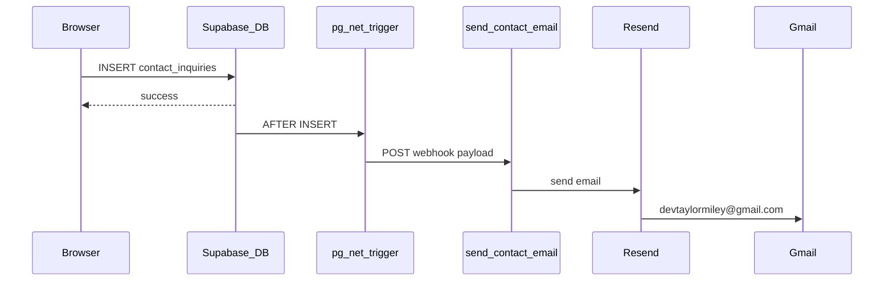

## Supabase Setup

1. Create a Supabase project.
2. In Supabase SQL Editor, run [`schema.sql`](./schema.sql). If the project already exists, also run [`contact_inquiries.sql`](./contact_inquiries.sql) for the portfolio contact form.
3. In Supabase Auth:
   - Enable Google provider.
   - Add your local/app redirect URL:
     - `http://localhost:5173/projects/blackfang-campaign/kt24-data`
4. Copy `.env.example` to `.env` and set:
   - `VITE_SUPABASE_URL`
   - `VITE_SUPABASE_ANON_KEY`

After this, users can sign in with Google and CRUD only their own homebrew teams/operatives.

## Contact form email (Edge Function + Resend)

The portfolio contact form inserts into `contact_inquiries`, then a database trigger calls the `send-contact-email` Edge Function, which sends mail via [Resend](https://resend.com).



### One-time setup (CLI)

Install the [Supabase CLI](https://supabase.com/docs/guides/cli), log in, and link this repo:

```bash
npm run supabase:link
```

Apply database objects (safe to re-run):

```bash
npm run supabase:contact-db
npm run supabase:contact-webhook
```

Deploy the Edge Function:

```bash
npm run supabase:deploy-contact-email
```

### Resend secrets

1. Create a [Resend](https://resend.com) account and API key.
2. Verify a sending domain in Resend (required for production). Use e.g. `Portfolio <contact@yourdomain.com>`.
   - For quick testing only, Resend’s `onboarding@resend.dev` can send to the Resend account owner’s inbox.
3. Set Supabase secrets and redeploy:

**Important:** `CONTACT_FROM_EMAIL` must use a domain **verified in Resend**. Until `taylormiley.net` (or your domain) is verified, use `onboarding@resend.dev` for testing (delivers only to your Resend account email).

**PowerShell (Windows):**

```powershell
$env:RESEND_API_KEY = "re_..."
$env:CONTACT_FROM_EMAIL = "Portfolio <contact@yourdomain.com>"
.\scripts\setup-contact-email.ps1
```

After verifying your domain in Resend, switch back from `onboarding@resend.dev`:

```powershell
npx supabase secrets set "CONTACT_FROM_EMAIL=Portfolio <contact@taylormiley.net>"
npm run supabase:deploy-contact-email
```

**Bash:**

```bash
npx supabase secrets set \
  RESEND_API_KEY=re_... \
  CONTACT_FROM_EMAIL="Portfolio <contact@yourdomain.com>" \
  CONTACT_TO_EMAIL=devtaylormiley@gmail.com
npm run supabase:deploy-contact-email
```

Secrets are stored in Supabase only — never add `RESEND_API_KEY` to Vite or Vercel env vars.

### Verify

1. Submit the contact form on the live or local site.
2. Confirm a row in **Table Editor → contact_inquiries**.
3. Check **Edge Functions → send-contact-email → Logs** in the Supabase dashboard.
4. Confirm email in Gmail (check spam once).

### Files

| File | Purpose |
|------|---------|
| [`contact_inquiries.sql`](./contact_inquiries.sql) | Table + RLS insert policy |
| [`contact_inquiry_email_webhook.sql`](./contact_inquiry_email_webhook.sql) | `pg_net` trigger → Edge Function |
| [`functions/send-contact-email/index.ts`](./functions/send-contact-email/index.ts) | Resend email sender |
| [`../scripts/setup-contact-email.ps1`](../scripts/setup-contact-email.ps1) | Helper to set secrets + redeploy |
